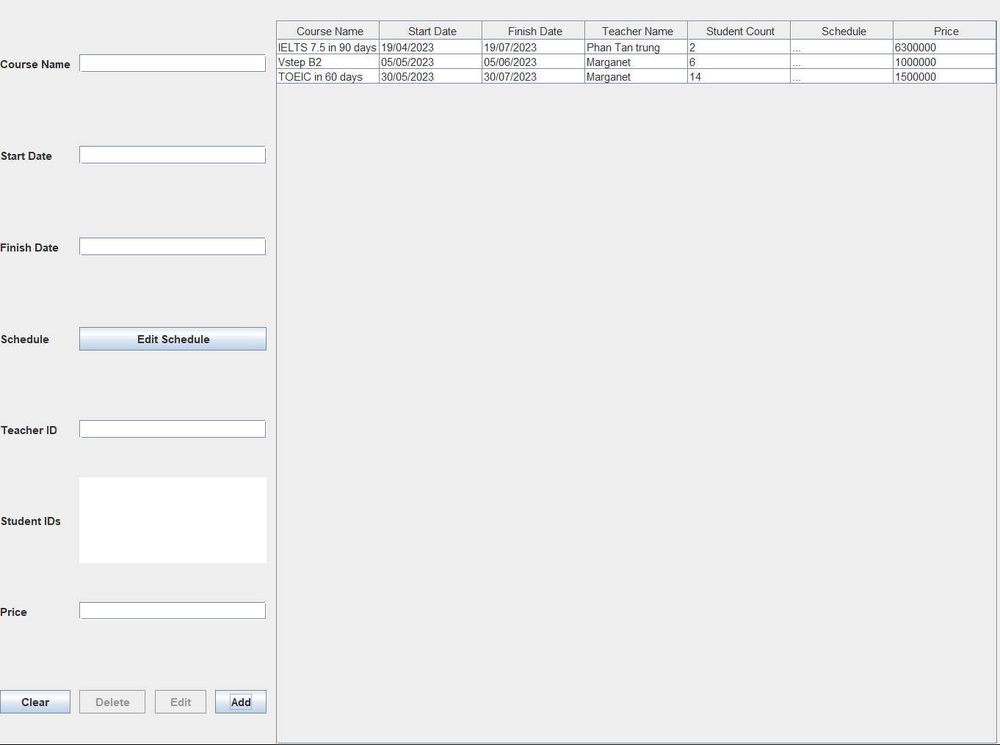

# QUẢN LÝ TRUNG TÂM NGOẠI NGỮ

## Thông tin ứng dụng
- Tên ứng dụng: **Quản lý trung tâm ngoại ngữ**
- Mã nguồn: https://github.com/MinkuruDev/OOPLearning/tree/master/SV24/NguyenTrungVinh/GHP
- Người thực hiện: ***[Nguyễn Trung Vĩnh](https://github.com/MinkuruDev)***
- Ngôn ngữ chính: **Java**
- Ngày code: **13/04/2023**
- Ngày hoàn thành: **04/05/2023**

## Hướng dẫn sử dụng

### Chạy ứng dụng
- Sử dụng IDE ***[IntelliJ IDEA](https://www.jetbrains.com/idea/)***
- Chạy File ***Application.java***

### Đăng nhập
- Tên đăng nhập: admin
- Mật khẩu: admin

### Thanh điều hướng

Sử dụng các nút để chuyển màn hình chính sang các chức năng quản lý tương ứng

### Quản lý thông tin học viên
Chọn ***Student*** trên thanh điều hướng để thực hiện chức năng quản lý thông tin học viên

1. Khu vực bên trái để nhập, sửa thông tin học viên
2. Khu vực bảng ở giữa để hiển thị thông tin của tất cả học viên hoặc một số học viên khớp với yêu cầu tìm kiếm
3. Khu vực bên phải dùng để tìm kiếm học viên, kết quả sau khi tìm kiếm sẽ được hiển thị trên bảng

### Quản lý thông tin giáo viên
Chọn ***Teacher*** trên thanh điều hướng để thực hiện chức năng quản lý thông tin giáo viên

1. Khu vực bên trái để nhập, sửa thông tin giáo viên
2. Khu vực bảng ở giữa để hiển thị thông tin của tất cả giáo viên hoặc một số giáo viên khớp với yêu cầu tìm kiếm
3. Khu vực bên phải dùng để tìm kiếm giáo viên, kết quả sau khi tìm kiếm sẽ được hiển thị trên bảng

### Quản lý thông tin gói học
Chọn ***Course*** trên thanh điều hướng để thực hiện chức năng quản lý thông tin gói học

1. Khu vực bên trái để nhập, sửa thông tin gói học
2. Khu vực bảng ở giữa để hiển thị thông tin của tất cả các gói học hoặc một số gói học khớp với yêu cầu tìm kiếm
3. Khu vực bên phải dùng để tìm kiếm gói học, kết quả sau khi tìm kiếm sẽ được hiển thị trên bảng
4. Nếu ở cột Teacher Name hiển thị **!!!** có nghĩa là ID giáo viên không hợp lệ 
5. Ấn vào **...** ở cột **Schedule** để hiển thị lịch học của gói học tương ứng

minh hoạ lịch học của một gói học

### Quản lý thông tin kỳ thi
Chọn ***Exam*** trên thanh điều hướng để thực hiện chức năng quản lý thông tin kỳ thi

1. Khu vực bên trái dùng để nhập, sửa thông tin kỳ thi
2. Khu vực bảng ở giữa để hiển thị thông tin của tất cả các kỳ thi hoặc một số kỳ thi khớp với yêu cầu tìm kiếm
3. Khu vực bên phải để tìm kiếm kỳ thi, kết quả sau khi tìm kiếm sẽ được hiển thị trên bảng

### Quản lý thông tin tài liệu
Chọn ***Document*** trên thanh điều hướng để thực hiện chức năng quản lý thông tin tài liệu

1. Khu vực bên trái dùng để nhập, sửa thông tin tài liệu
2. Khu vực bảng ở giữa để hiển thị thông tin của tất cả các tài liệu hoặc một số tài liệu khớp với yêu cầu tìm kiếm
3. Khu vực bên phải để tìm kiếm tài liệu, kết quả sau khi tìm kiếm sẽ được hiển thị trên bảng

### Thêm Dữ liệu
- Tại bên trái cửa sổ ứng dụng, nhập đầy đủ các thông tin theo đúng định dạng (Trường ID không thể nhập)

minh hoạ thêm nhập thông tin
- Đối với nhập thông tin gói học, ấn nút **Edit Schedule** để nhập lịch học của gói học

minh hoạ nhập lịch học
- Sau khi đã nhập đầy đủ thông tin, ấn nút **Add** để thêm dữ liệu

sau khi thêm thành công

***Lưu ý khi nhập thông tin:***
1. Nhập ngày (Start date/End date) phải nhập theo định dạng **yyyy-MM-dd**
   ví dụ nếu muốn nhập **ngày 30 tháng 4 năm 2023** thì nhập **2023-04-30**
2. Thông tin ID của các học viên (Student IDs) nhập các id của học viên
   cách nhau ***một ký tự cách hoặc 1 ký tự xuống dòng***
3. Nhập thời gian (Exam time) là thời gian trong ngày theo định dạng **hh:mm**
   ví dụ nếu muốn nhập **14 giờ 30 phút** thì nhập **14:30**
4. Không được để trống trường thông tin (trừ trường ID)

***Những cảnh báo khi để trống trường thông tin/nhập sai định dạng***

### Chỉnh sửa dữ liệu
- Tại bảng hiển thị dữ liệu, click chuột vào thông tin của đối tượng muốn sửa, sau đó thông tin
sẽ được điền vào các trường tương ứng ở bên trái

Chọn đối tượng cần sửa dữ liệu
- Tại các trường thông tin, sửa dữ liệu cần thiết

nhập dữ liệu cần sửa (trên hình đã sửa fullName và address)
- nhấn nút **Edit**

Sau khi sửa xong

***Lưu ý***
1. Sửa dữ liệu cũng cần phải nhập đúng định dạng và không được để trống
2. Khi dữ liệu đã được tải vào các trường thì không thể thêm mới. Ấn **Clear** 
để xoá thông tin tại các trường nhập, dữ liệu gốc sẽ không bị mất

### Sắp xếp dữ liệu
- Tại bảng hiển thị dữ liệu, ấn vào tên cột để sắp xếp theo thuộc tính đó tăng dần
- Dữ liệu trước khi sắp xếp

- Dữ liệu sau khi được sắp xếp (theo tuổi)

### Xoá dữ liệu
- Tại bảng hiển thị dữ liệu, chọn hàng dữ liệu cần xoá
- Ấn nút **Delete** để xoá dữ liệu

### Tìm kiếm
- Tại bên phải cửa sổ ứng dụng, nhập các lựa chọn tìm kiếm để tìm ra dữ liệu khớp với yêu cầu
- Khi nhập ngày, định dạng nhập giống như nhập dữ liệu
- Nếu nhập sai định dạng, sẽ coi như là bỏ trống điều kiện
- Ví dụ minh hoạ, tìm kiếm học viên có tuổi nhỏ hơn hoặc bằng 20 và có email là @rhodes

- Để hiển thị dữ liệu ban đầu, chọn **Clear Search Result**
